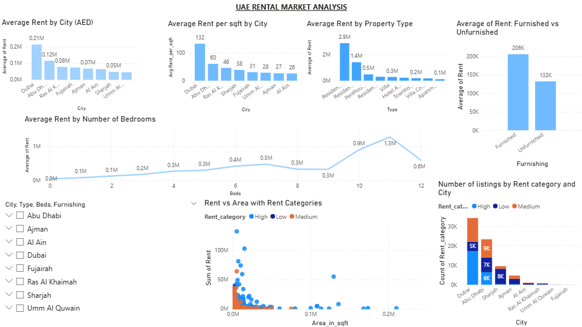

# uae-rental-market-analysis
Exploratory Data Analysis and Power BI dashboard of the UAE rental housing market.
# UAE Rental Market Analysis

## Overview

This project analyzes the UAE residential rental market using exploratory data analysis and an interactive dashboard.
The goal was to understand rental price patterns, property characteristics, and geographic differences across cities.

The project combines **Python-based data analysis** with a **Power BI dashboard** to generate business insights.

---

## Dataset

The dataset contains rental property listings across multiple UAE cities, including:

* Rent price (AED)
* Property type
* Area (sqft)
* Number of bedrooms
* Furnishing status
* City/location

After cleaning, the dataset was used to perform feature engineering and exploratory analysis.

## Project Workflow

### 1. Data Cleaning

* Removed duplicates and null values
* Investigated extreme outliers
* Applied log transformation to rent values

### 2. Feature Engineering

Created new analytical features such as:

* Rent per bedroom
* Price density
* Rent category (Low / Medium / High)
* Classified cities into Premium, Mid and Budget tiers.

### 3. Exploratory Data Analysis

Key analyses included:

* Average rent by city
* Rent per square foot comparison
* Property type price differences
* Bedroom count vs rent
* Furnished vs unfurnished rent comparison

### 4. Power BI Dashboard

An interactive dashboard was created to visualize:

* Average rent by city
* Rent per square foot by location
* Rent distribution by property type
* Bedroom vs rent trends
* Rent categories across cities

## Key Insights

* Dubai dominates the premium rental market.
* Furnished properties command significantly higher rents.
* Property size and bedroom count show a positive relationship with rent.
* Most listings fall within the low–medium rental segments.

## Tools Used

* Python
* Pandas
* Seaborn / Matplotlib
* Power BI
* Google Colab

## Repository Structure

data – cleaned dataset
notebooks – exploratory data analysis notebook
dashboard – Power BI dashboard file

## Author
Nelina Noble
